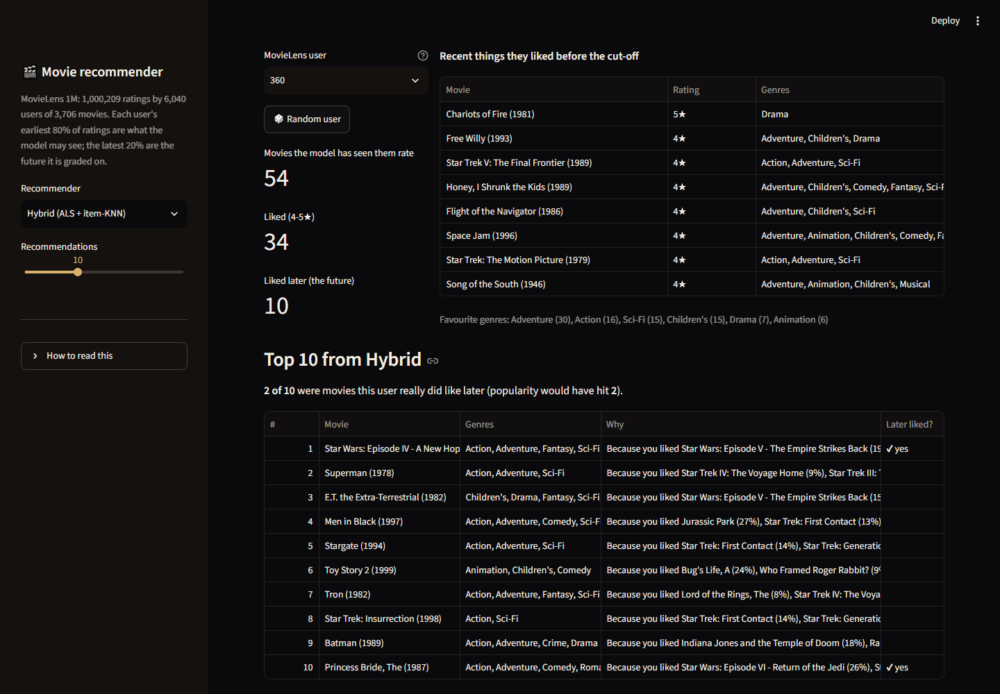
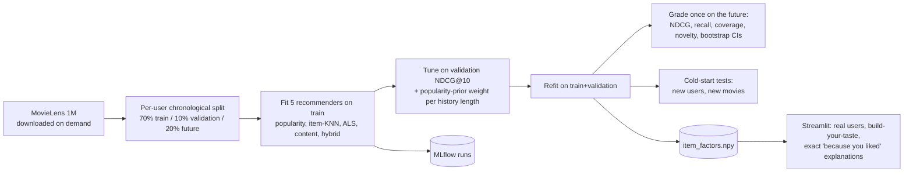
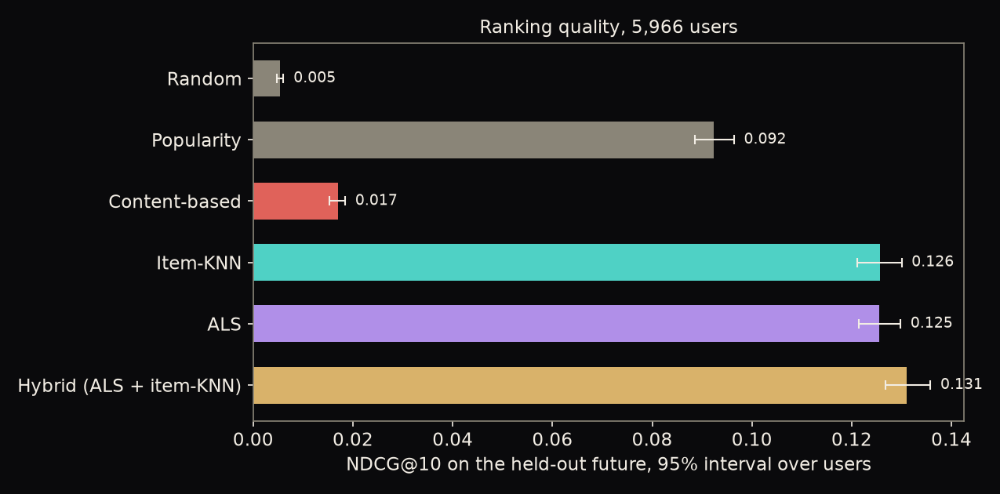
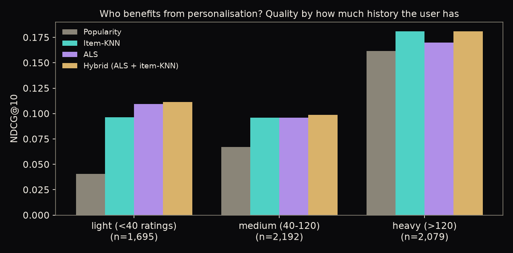
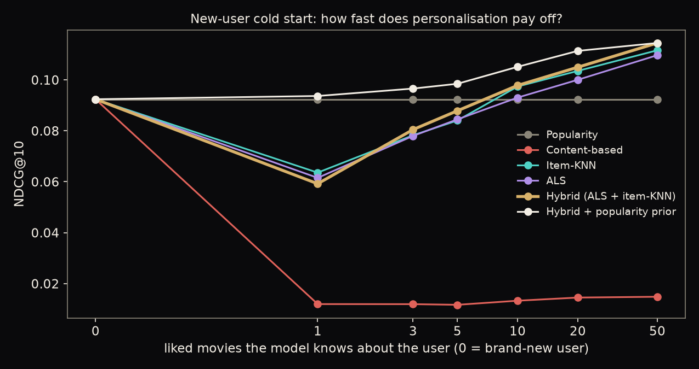
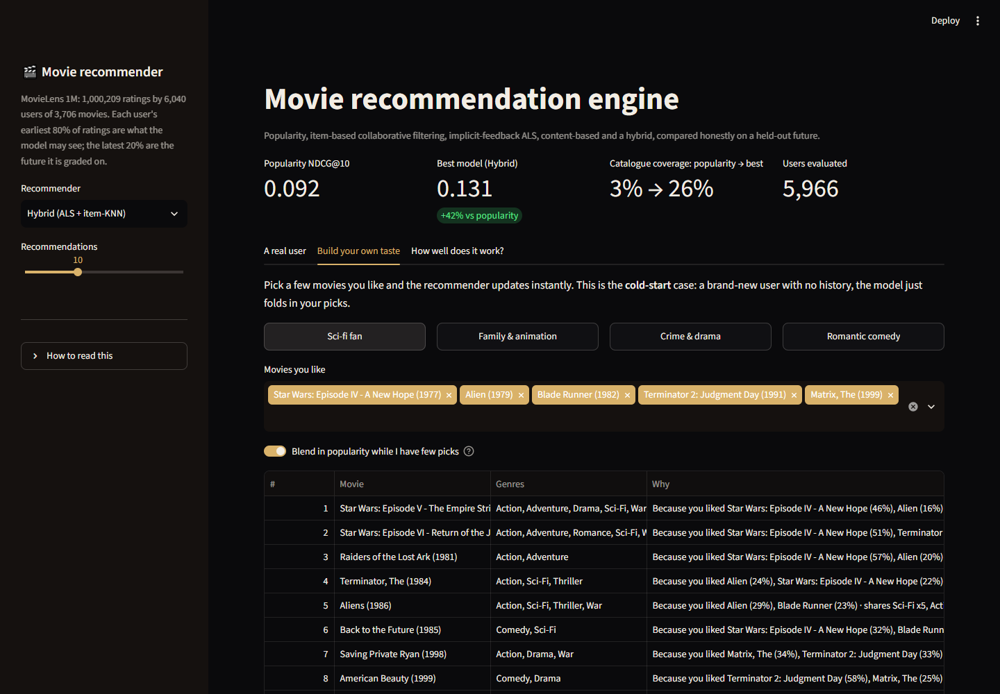
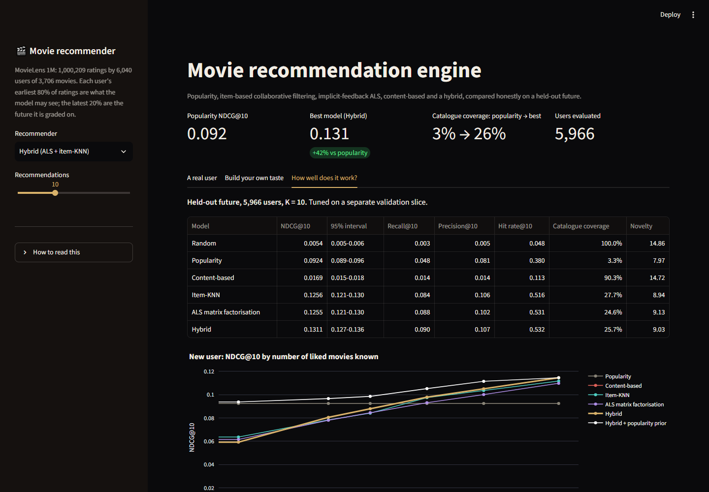

# Movie Recommendation Engine: Collaborative Filtering, Hybrids and Cold Start

Recommends 10 movies per user and explains every one. Compares a **popularity** baseline, **item-based collaborative filtering**, **implicit-feedback matrix factorisation (ALS, written in numpy)**, a **content-based** model and a **hybrid**, judges them on each user's *future* ratings with ranking metrics (NDCG, recall, coverage, novelty), and tests the case recommenders usually fail: **new users and new movies**. A Streamlit app lets you browse real users, build your own taste from a few picks, and see why each title was recommended.

**Live demo:** https://movie-recommendation-engine-8z7hsjydsp4cgjhs38wkvm.streamlit.app/ · **Stack:** numpy, scipy, scikit-learn, MLflow, Streamlit + Plotly



## 1. Business problem

| | |
|---|---|
| **Stakeholder** | Product team of a streaming or e-commerce service |
| **Decision** | Which 10 titles to put in front of each user |
| **The tension** | "Most popular" is easy and hard to beat, but it shows everyone the same 30 blockbusters and buries the catalogue. A personalised list has to be measurably better *and* work for people we know nothing about yet |
| **KPIs** | **NDCG@10** and **recall@10** on what the user goes on to like (ranking quality that rewards putting hits first); **catalogue coverage** and **novelty** (does it use the long tail?); **cold-start behaviour** (new user, new title) |

## 2. Data

**MovieLens 1M** (GroupLens, University of Minnesota): 1,000,209 ratings of 3,706 movies by 6,040 users, 1-5 stars, with movie titles and genres. Public, no login. Density 4.5%, and a long tail: a small number of movies collects most of the likes, which is why popularity is a strong baseline.

The MovieLens licence **forbids redistributing the data**, so it is not in this repository. `recsys.data.download()` fetches it from GroupLens on demand and the deployed app does the same on first run (~30 s). Only the trained item factors (0.5 MB) and result files are committed. Citation: *F. Maxwell Harper and Joseph A. Konstan (2015). The MovieLens Datasets: History and Context. ACM TiiS 5(4).*

**"Liked" = a rating of 4 or 5** (58% of ratings). Everything below is about predicting liked movies.

## 3. Architecture



**Evaluation design.** Each user's earliest 70% of ratings train the models, the next 10% tune them, the **last 20% is a held-out future**. A random split would let the model see a user's later taste. Movies a user already rated are never recommended. Tuning uses validation only; the test slice is graded once, after refitting on train+validation. 5,966 users have at least one liked movie in the test slice and are evaluated; intervals are 95% bootstraps over users.

## 4. The models

| Model | Idea |
|---|---|
| **Popularity** | Same list for everyone: the movies most people liked. The baseline that has to be beaten |
| **Item-KNN** | Two movies are similar if the same people liked both (cosine, shrinkage, top-100 neighbours). Score = similarity to what you liked |
| **ALS** | Matrix factorisation for implicit feedback (Hu, Koren & Volinsky 2008), **implemented from scratch in numpy**: 32 factors, confidence 1+3 per like. The user vector is never stored: it is *folded in* in closed form from any history, so a new user needs no retraining |
| **Content-based** | Movie attribute vectors (genres, release decade, optionally title words); the user profile is their liked movies' average |
| **Hybrid** | Weighted sum of per-user standardised ALS and item-KNN scores (weights chosen on validation; a content term was tried and validation gave it weight 0) |

Hyper-parameters were tuned on the validation slice (`artifacts/tuning.json`, every trial also in MLflow): item-KNN k in 20-200 and shrinkage 0-50; ALS confidence 1-40, factors 16-64, regulariser 0.01-1; four content feature sets; 12 hybrid weight pairs.

## 5. Results (held-out future, 5,966 users, K = 10)

| Model | **NDCG@10** | 95% interval | Recall@10 | Hit rate@10 | Catalogue coverage | Novelty (bits) |
|---|---|---|---|---|---|---|
| Random | 0.005 | 0.005-0.006 | 0.003 | 0.048 | 100% | 14.9 |
| Popularity | 0.092 | 0.089-0.096 | 0.048 | 0.381 | 3.3% | 8.0 |
| Content-based | 0.017 | 0.015-0.018 | 0.014 | 0.113 | 90.3% | 14.7 |
| Item-KNN | 0.126 | 0.121-0.130 | 0.084 | 0.516 | 27.7% | 8.9 |
| ALS | 0.126 | 0.121-0.130 | 0.088 | 0.531 | 24.6% | 9.1 |
| **Hybrid (ALS + item-KNN)** | **0.131** | 0.127-0.136 | **0.090** | **0.532** | 25.7% | 9.0 |



What this says, including the unflattering parts:

1. **Personalisation clearly works.** ALS and item-KNN each beat popularity by +0.033 NDCG@10 (paired 95% CI +0.029 to +0.037), a ~36% relative gain; the hybrid gains +0.039 (+42%).
2. **ALS is not better than item-KNN here.** They are statistically tied (difference -0.0002, CI -0.003 to +0.003). ALS ships as the deployable, scalable backbone (fold-in, compact factors), not because it wins.
3. **The hybrid's edge is small but real.** +0.0056 over ALS (CI +0.004 to +0.007): the two models make different mistakes. Blending is worth a few percent, not a step change.
4. **Content-based alone is weak** (0.017, about 3x random). 18 genres cannot separate 3,700 movies. It earns its place in the cold-start-item test below, not in warm ranking.
5. **Variety came free.** Popularity recommends 3.3% of the catalogue to everybody; the collaborative models reach ~25% and recommend more niche movies, at higher accuracy. (Coverage counts distinct recommended titles; it is not a fairness or business-value measure.)

### Who benefits?



Light users (<40 ratings) gain the most in relative terms: popularity 0.040 to 0.112 for the hybrid, almost 3x. For heavy users (>120 ratings) popularity is already strong (0.161) and personalisation adds ~12% (0.181).

## 6. Cold start

### New user

The model is given only the first *m* liked movies (as if from an onboarding "pick your favourites" screen) and graded on the same future.



| Liked movies known (m) | Popularity | Hybrid | **Hybrid + popularity prior** |
|---|---|---|---|
| 1 | 0.092 | 0.059 | **0.094** |
| 3 | 0.092 | 0.081 | **0.097** |
| 5 | 0.092 | 0.088 | **0.099** |
| 10 | 0.092 | 0.098 | **0.105** |
| 20 | 0.092 | 0.105 | **0.111** |
| 50 | 0.092 | 0.114 | **0.114** |

The honest finding: **with 1-5 liked movies the personalised models are *worse than popularity*.** A handful of picks is a noisy signal, and confident personalisation from it loses to "what everyone likes". They overtake popularity at about 10 likes. The fix is a **popularity prior** blended into the standardised score, with a weight tuned *on validation data* for each history length (4, 2, 1, 0.5, 0.5, 0 for m = 1, 3, 5, 10, 20, 50): the weight falls as we learn more about the user, and the blend is at least as good as the better of the two at every m. (The line from m = 0 to 1 in the figure is only a guide: at m = 0 every model falls back to popularity by design. The weight at m = 1 sat at the edge of the search grid (4.0) with a flat top, so it may be slightly higher still.) The app applies this weight automatically in the "Build your own taste" tab.

### New movie

10% of the catalogue (370 movies) is hidden from training completely, and each user's later likes among them are ranked against only those movies.

| Ranker | NDCG@10 | Recall@10 |
|---|---|---|
| Random | 0.017 | 0.027 |
| Content: genres only | **0.048** | 0.080 |
| Content: genres + era | 0.045 | 0.077 |
| Content: genres + era + title words | 0.046 | 0.082 |
| ALS / item-KNN | cannot score a movie nobody has rated | |

Content similarity is ~2.9x random for a movie with no ratings, the only kind of signal such a movie has. Modest, but it is the difference between "can recommend new releases" and "cannot". Title words (franchise signal) did not help beyond genres in this test.

## 7. Explanations that are exact

For ALS the score of a recommended movie splits **additively** over the movies the user liked: `score = sum_h (1 + alpha) * y_h^T A^-1 y_item`, where `A` is the user's normal-equation matrix. So "because you liked *Alien* (29%), *Blade Runner* (23%)" is the model's own arithmetic, not a post-hoc story, and a test checks the pieces sum to the score. Example from the app (user 360, hybrid model):

> **Men in Black** ← *Jurassic Park* (27%), *Star Trek: First Contact* (13%) · **Toy Story 2** ← *A Bug's Life* (24%), *Who Framed Roger Rabbit?* (9%)

## 8. The app

`app/streamlit_app.py`, three tabs:

- **A real user**: pick any of 400 real users (or a random one). It shows what they liked before the cut-off, the top-N from the chosen model with the *why* for each, and marks **✔ later liked** when the user really did rate that movie 4+ afterwards, with a "popularity would have hit N" comparison.
- **Build your own taste**: pick movies (or a preset like "Sci-fi fan") and get instant recommendations from a genuinely new user vector. The popularity-prior toggle is on by default.
- **How well does it work?**: the results table and the new-user curve.

| Build your own taste | Evaluation |
|---|---|
|  |  |

The "later liked?" check under-counts good recommendations (a great movie the user never got round to rating looks like a miss), so it is an honest lower bound, not the model's score.

## 9. Limitations

- **One 2000-2003 dataset of explicit ratings.** Real services use clicks, watch time and context; "rating >= 4" is a stand-in for "would enjoy". Nothing here says how the models behave on modern streaming catalogues.
- **Offline evaluation only.** Better NDCG on a held-out slice is not proof of better engagement; only an A/B test is (see the A/B testing project in this portfolio).
- **Movies rated in the future slice were, by definition, ones the user chose to rate**, which biases towards popular titles and flatters popularity.
- **No time-aware model** (recency, taste drift) and no session context; the ALS is static.
- **Content features are thin** (genres, decade, title words). Plot text, cast or posters would help the new-movie case a lot.
- **Cold-start prior weights** were tuned on one split; the m = 1 weight sits at the grid edge.
- **The 5,966 evaluated users** each contribute equally; heavy users have more relevant items and a different profile than light ones (see segments).

## 10. Run it

```bash
uv sync --all-groups
uv run python -m recsys.train          # downloads MovieLens (~6 MB), tunes and grades everything (~12 min); cached tuning: artifacts/tuning.json
uv run python -m recsys.report         # figures
uv run streamlit run app/streamlit_app.py
uv run pytest -q && uv run ruff check .
```

`python -m recsys.train --retune` redoes the validation search. Every tuning trial and test metric is in MLflow (`mlflow.db`, experiment `recsys`): `python -m mlflow ui --backend-store-uri sqlite:///mlflow.db`.

```
src/recsys/   config, data (download, chronological split), models, metrics, experiment, cold, explain, train, report
app/          Streamlit app
artifacts/    item_factors.npy, results.json, tuning.json, hyperparams.json
notebooks/    01_recommender_analysis.ipynb (executed)
tests/        13 offline tests on synthetic data
```

**Deploy:** Streamlit Community Cloud (main file `app/streamlit_app.py`; first load downloads MovieLens and builds the models, ~30 s) or the included `Dockerfile`. CI runs ruff and pytest on every push.

## Attribution and license

Code: MIT (`LICENSE`). Data: MovieLens 1M, (c) GroupLens Research, University of Minnesota, for research and education, **not redistributed here**; see https://grouplens.org/datasets/movielens/1m/. Please cite Harper & Konstan (2015) as above.
